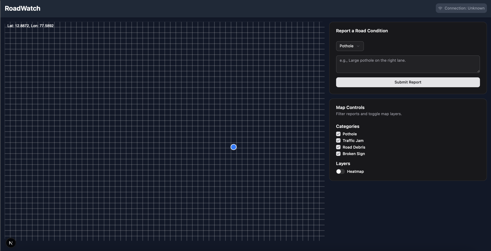
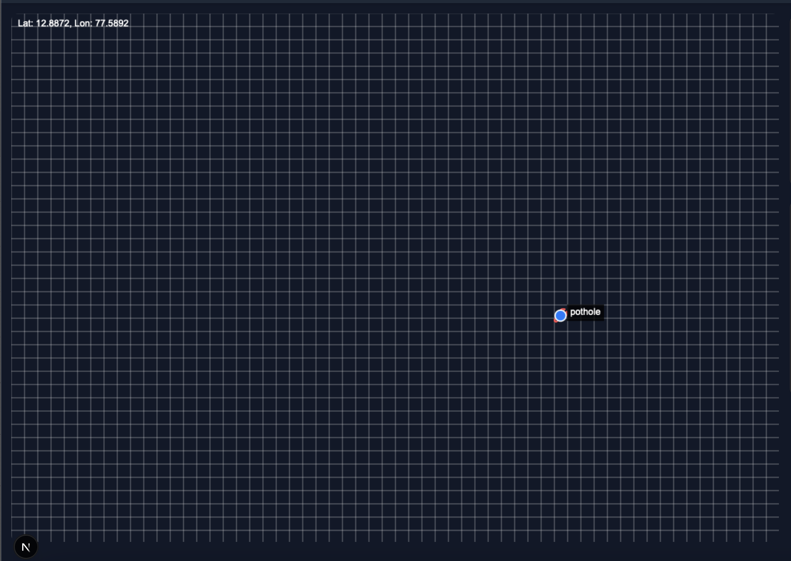
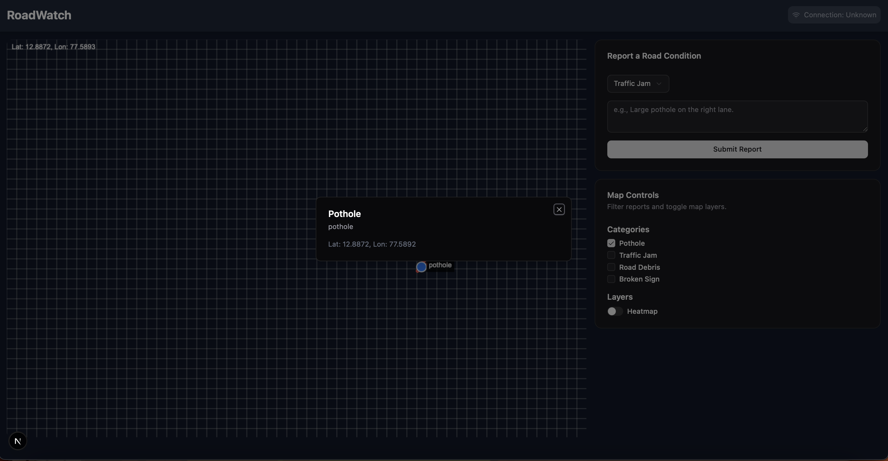

# RoadWatch: Real-Time Road Condition Reporter

RoadWatch is a modern, interactive web application designed to solve the real-world problem of outdated or inaccessible information about road conditions. It empowers drivers and cyclists with a community-driven platform to report and view issues like potholes, traffic jams, and road debris in real-time.






## The Problem

Drivers and cyclists often lack a centralized, up-to-the-minute source for road conditions. This can lead to unsafe situations, vehicle damage, and travel delays. Existing tools are often slow, difficult to use, or lack the detailed, user-generated content needed to be effective.

## The Solution

RoadWatch provides an intuitive, map-based interface where users can instantly report road issues from their current location. The application is designed to be highly interactive and network-aware, ensuring a smooth experience even on slower connections.

## Key Features

-   **Interactive Map**: A dynamic map interface built with the Canvas API serves as the core of the application.
-   **Live Geolocation**: Utilizes the Geolocation API's `watchPosition` to track the user's location in real-time, displayed as a unique, animated marker.
-   **Categorized & Icon-Based Reporting**: Users can report various incident types (Potholes, Traffic Jams, etc.), each represented by a distinct, animated icon on the map.
-   **Dynamic Filtering**: Easily filter visible reports on the map by category using a clean, modern set of controls.
-   **Heatmap Overlay**: A toggleable heatmap layer provides an at-a-glance overview of incident-dense areas.
-   **Interactive Tooltips & Details**: Hover over an incident icon to see a quick description, or click to open a detailed dialog view.
-   **Responsive Dark-Themed UI**: Built with Tailwind CSS and shadcn/ui for a polished, responsive, and modern dark-mode interface.
-   **Network-Aware**: Leverages the Network Information API to display the user's current connection status.

## Core Web APIs Used

This project was built to solve a real-world problem using modern web platform features. The following Web APIs were essential to its functionality:

1.  **[Geolocation API](https://developer.mozilla.org/en-US/docs/Web/API/Geolocation_API)**: Used to capture the user's live location for tagging reports and displaying their position on the map.
2.  **[Canvas API](https://developer.mozilla.org/en-US/docs/Web/API/Canvas_API)**: Powers the entire interactive map, including rendering the grid, animated report icons, the user's location marker, and the heatmap overlay.
3.  **[Network Information API](https://developer.mozilla.org/en-US/docs/Web/API/Network_Information_API)**: Used to detect and display the user's network quality in the header.

## Tech Stack

-   **Framework**: [Next.js](https://nextjs.org/)
-   **Language**: [TypeScript](https://www.typescriptlang.org/)
-   **Styling**: [Tailwind CSS](https://tailwindcss.com/)
-   **UI Components**: [shadcn/ui](https://ui.shadcn.com/)
-   **Icons**: [Lucide React](https://lucide.dev/)
-   **Heatmap**: [Heatmap.js](https://www.patrick-wied.at/static/heatmapjs/)

## Getting Started

To run this project locally, follow these steps:

1.  **Clone the repository:**
    ```bash
    git clone <repository-url>
    cd <repository-directory>
    ```

2.  **Install dependencies:**
    ```bash
    npm install
    ```

3.  **Run the development server:**
    ```bash
    npm run dev
    ```

4.  **Open the application:**
    Open [http://localhost:3000](http://localhost:3000) in your browser to see the result. Your browser will prompt you for location access, which is required for the application to function correctly.

---

This project was built as a demonstration of modern web capabilities.
